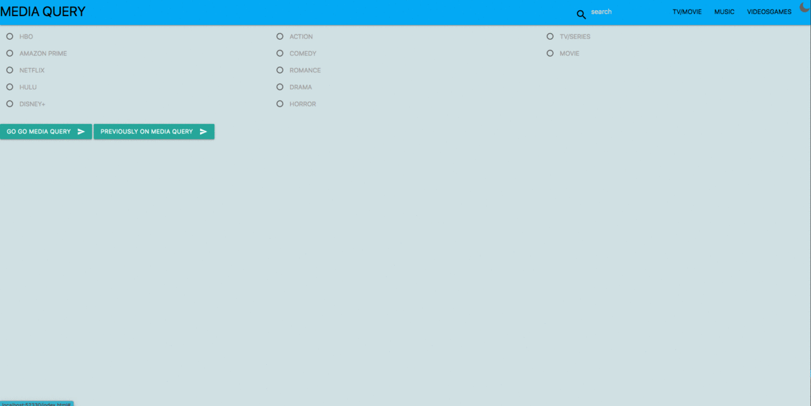

# MEDIA QUERY

## Description

The motivation to build the app was to solve a problem every member of our group had faced, which was trying to find what to watch on TV either it be a movie or a series. The app allows the user to search for a television show or movie and locate which streaming service it can viewed on. The user can find a specific title of a media source or by user filters to find where to watch it. 

## Installation 

The first step of developing was app was with the use of the CSS framework Materialize. The second step we needed to achieve was finding and choosing a working API that would fit our needs, we used an API marketplace known as RapidAPI to locate our two APIs. We also used JavaScript to connect the HTML components to the API to display our search results on the page so the user could make sense of the date that was being fetched. Our group added a dark mode to the app which can be toggled by the user, in order for the users app appearance to be persistent we saved that information in local storage. 

## Usage 

The user can find a movie or tv show two different ways. One way a user can find random titles is by toggling the radio buttons and then hitting the button at the bottom on the screen. Another way the user can find a title is by doing a specific search in the sech bar in the navigation bar and then hitting the enter key. The user can toggle dark mode by toggling the Moon icon in the right and conner to revert back to light mode the user need to toggle the Sun icon in the same location. 

## Gif 

## Credits 

Ross Holtrop
https://github.com/raws-boop

Drew Gillespie
https://github.com/drewg07

Son Le 
https://github.com/Sonlocgiau

Michael Adusah
https://github.com/MikeAdu

Materialize 
https://materializecss.com/

Easy Tutorials 
Dark Theme https://www.youtube.com/watch?v=9LZGB3OLXNQ
Sun and Moon icon: https://doc-0g-8c-docs.googleusercontent.com/docs/securesc/1f8s46f1ect42gfft23g3dqmcc7tphce/ip7qvv6q760t6n63vasb68i1ej80d1mf/1620420825000/11547991968947048879/06145021185591029006/1luGpVOJhekRCZ479DWn9-pfmx4GuR1oj?e=download&authuser=0&nonce=2su775nu5t56e&user=06145021185591029006&hash=0e0d31uaq7kmnuv8ndgprecvu65ehjtb

## Deployed Link: 
https://raws-boop.github.io/media_query/

## Presentation link 
https://docs.google.com/presentation/d/1_SwSgfyeSjbJPB2aNt48JHHOuNrLgKS24O13GNXbxbc/edit#slide=id.g29f43f0a72_0_24

